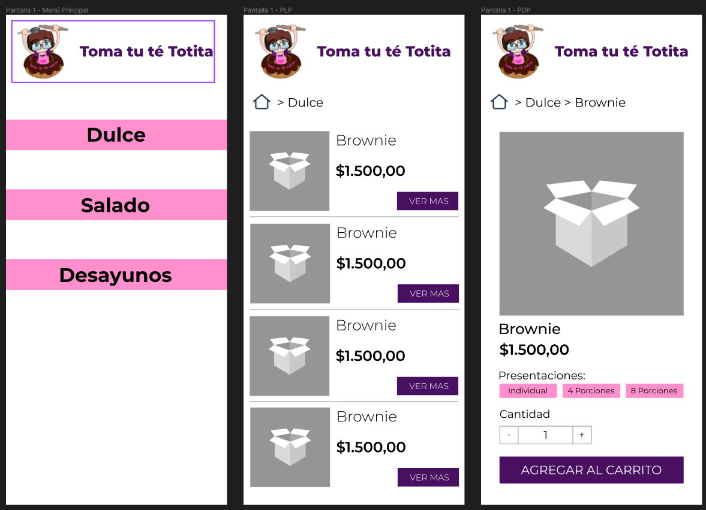
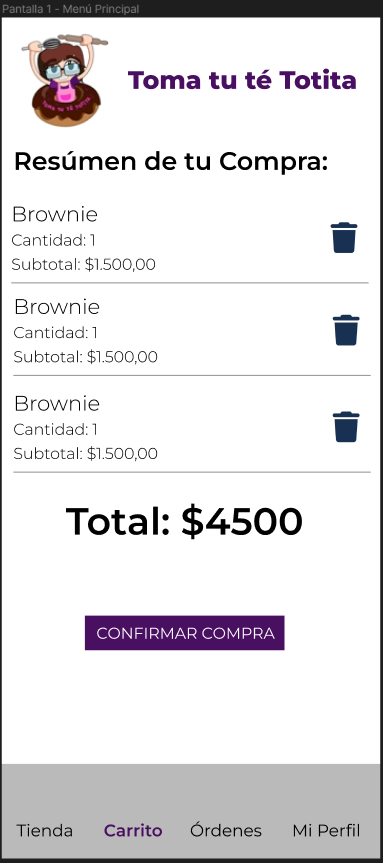
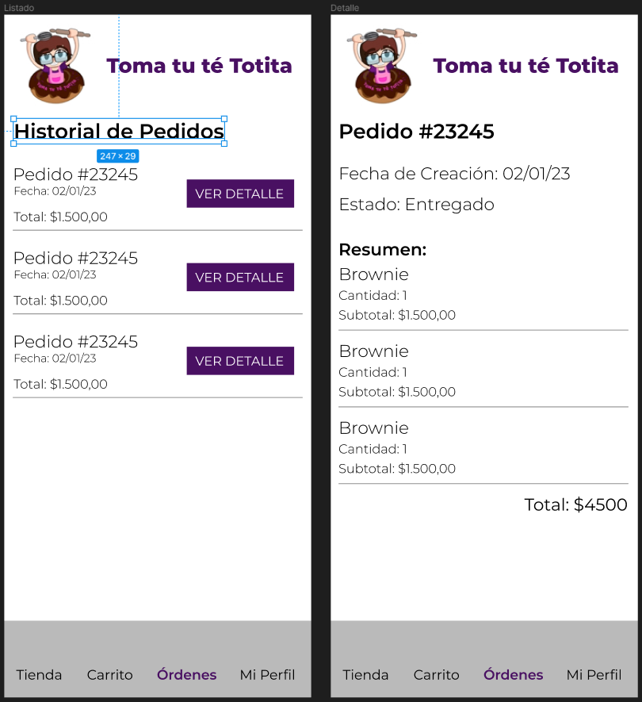

# Proyecto React Native - App de Panadería

## Wirefram de la app

## Detalles:

### Tab Navigator

La navegación inferior permite cambiar entre 4 tabs: Shop, Carrito, Ordenes y Mi Perfil

### Screens - Shop 

- **Pantalla Principal**

El usuario ingresa a una primera pantalla que presenta un listado de categorías navegables, que conducen al lista de productos dentro de cada una.

- **Listado de Productos**

Cada categoría muestra el listado de los productos que le pertenecen y un BreadCrumb en la parte superior desde donde se puede volver a la Home. Además cada tarjeta de producto tiene un botón para ver más información al respecto de cada uno, que conduce al detalle del mismo.

- **Detalle de Producto**

El detalle de producto muestra la foto, el nombre y el precio. Un selector de qué presentación quiere adquirir el cliente, un selector de cantidad de unidades para comprar y el botón de Agregar al Carrito. 

También se incluye un BreadCrumb que permite volver al menú principal o navegar de vuelta a la categoría.

### Screens - Cart 

- **Detalle del carrito**

El usuario puede ver el resúmen de su carrito y finalizar la compra o eliminar productos.

### Screens - Órdenes 

- **Historial**

El usuario puede ver un listado de órdenes previas y acceder al detalle de las mismas

- **Detalle de Órdenes**

El usuario puede ver el detalle de la orden: los productos comprados, el total, la fecha y el estado de la misma.

## Librerías Instaladas:

- **Font Awesome** [Instalación](https://fontawesome.com/docs/web/use-with/react-native)

Se utilizó la librería FontAwesome para los símbolos como el de Home del BreadCrumb

- **React Navigation**

Se utilizó esta librería para establecer la navegación entre pantallas de la app